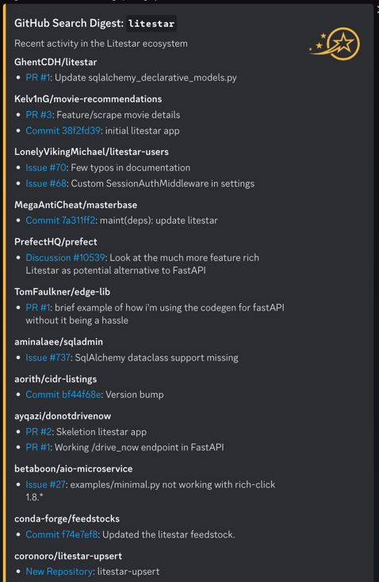

# Automations

[](https://github.com/jcrist/automations/actions/workflows/ci.yml)

Creates a digest of the latest goings-on for a repo
(soon to be multiple repos!) and posts it to Discord
via a given webhook.

~~Stolen~~ Inspired by [@jcrist](https://github.com/jcrist/automations/) :)

## Setup

1. Clone
2. Set up `DISCORD_COMMUNITY_WEBHOOK_URL`, `DISCORD_MAINTAINER_WEBHOOK_URL` secrets
3. Run CLI or CI

> [!NOTE]
> [Makefile](Makefile) is provided for convenience.

## Usage

Help:
```console
python ./github-digest/main.py --help
```

Common Usage:

Specify Terms:
```console
python ./github-digest/main.py --term litestar --term blarg
```

Specify new webhook:
```console
python ./github-digest/main.py --webhook https://discord.com/api/webhooks/1234567890/ABCDEF
```

## Example


